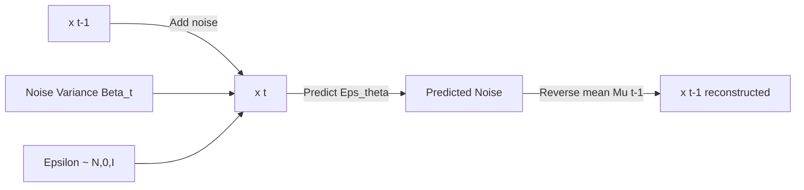
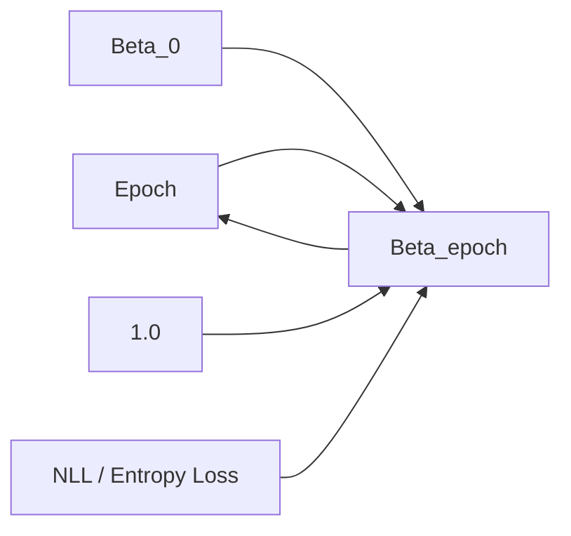

# Latent Diffusion NLP: Clifford-Optimized Generative Modeling (C++)

[](https://creativecommons.org/licenses/by-nc/4.0/)

A high-performance latent diffusion pipeline for natural language processing, combining tokenization, geometric embedding compression, and CNN-based noise prediction. This project demonstrates an end-to-end approach to generative modeling optimized for hardware efficiency.

> **Note:** This repository represents foundational research work in the development of quantum hybrid inference methodology, subsequently implemented under OmniHenos Ltd (2023–present).

---

## Zero Dependency Diffusion

This project implements a complete generative pipeline in pure C++17, treating natural language as a continuous geometric field rather than discrete tokens. By bypassing standard deep learning libraries, the engine achieves a "close-to-metal" implementation of stochastic differential equations (SDEs).

---

## Execution Logic: `Main.cpp`

The core framework is orchestrated within `Main.cpp`, which manages the lifecycle of latent representations through four distinct phases:

### 1. Tokenization & Embedding
The pipeline processes raw text into a compact vocabulary using a custom **BPE (Byte-Pair Encoding) Tokenizer**.
- **Dense Embedding:** Tokens are mapped into a 64-dimensional latent space.
- **Clifford Compression:** Embeddings are projected into a Clifford Manifold $C\ell_{p,q}(\mathbb{R})$ to retain multilinear relationships. This geometric approach allows for radical parameter reduction while maintaining the physical integrity of the token relationships.

### 2. Gaussian Diffusion Process
The forward diffusion process gradually injects Gaussian noise into the latent embeddings according to a variance schedule $\beta_t$:

$$x_t = \sqrt{1 - \beta_t} x_{t-1} + \sqrt{\beta_t} \epsilon, \quad \epsilon \sim \mathcal{N}(0, I)$$

### 3. CNN $\epsilon$-Prediction Network
A **Convolutional Neural Network (CNN)** is utilized as the core epsilon-predictor. Unlike standard MLPs, the CNN captures local spatial dependencies within the latent sequence:
- **Objective:** Minimize the Negative Log-Likelihood (NLL) of the noise distribution.
- **Optimization:** Gradients are computed via the `NormalDist` module to update the CNN kernels.

$$\mathcal{L} = -\log p_\theta(y \mid \mu, \sigma) = \frac{1}{2} \left( \frac{y - \mu}{\sigma} \right)^2 + \log(\sigma) + \frac{1}{2} \log(2\pi)$$

### 4. Adaptive BetaSchedule & Training Loop
The training loop utilizes a dynamic **BetaSchedule** that anneals the noise variance based on epoch progress and loss statistics:

$$\beta_{epoch} = \beta_0 \left(1 - \frac{epoch}{T}\right) + \frac{epoch}{T}$$

The reverse diffusion estimate $\mu_{t-1}$ reconstructs clean latent states from noisy inputs:

$$\mu_{t-1} = \frac{x_t - \beta_t \epsilon_\theta(x_t, t)}{\sqrt{1 - \beta_t}}$$

---

## Architecture Flow

### 1. High-Performance Tokenization & Geometric Embedding

- **Adaptive BPE Tokenizer:** A from-scratch Byte-Pair Encoding implementation that optimizes vocabulary entropy. Designed for minimal overhead during the C++ inference lifecycle.
- **Clifford Algebra-Based Compression ($C\ell_{p,q}$):** Token embeddings are projected into a Clifford Manifold. By utilizing the geometric product:
  $$uv = u \cdot v + u \wedge v$$
  we preserve the multilinear and rotational relationships between tokens, retaining high-dimensional semantic integrity at significantly reduced parameter count.
- **Deterministic Hashing:** Dense vector initialization uses a deterministic hashing scheme to ensure consistent latent mapping across distributed silicon clusters.


```mermaid
graph LR
    A[Raw Text] --> B[BPE Tokenizer]
    B --> C[Clifford Manifold]
    C --> D[Huffman Serialization]
    D --> E[Forward SDE / Noise]
    E --> F[Epsilon Predictor Training]
    F --> G[Reverse Diffusion Sampling]
    G --> H[Reconstructed Latents]
```


```mermaid
graph LR
    X_prev[x t-1] --> |Add noise| X_t[x t]
    Beta_t[Noise Variance Beta_t] --> X_t
    Noise[Epsilon ~ N,0,I] --> X_t
    X_t --> |Predict Eps_theta| PredictedEps[Predicted Noise]
    PredictedEps --> |Reverse mean Mu t-1| X_recon[x t-1 reconstructed]
```


```mermaid
graph LR
    Epoch[Epoch] --> Beta_t[Beta_epoch]
    BetaStart[Beta_0] --> Beta_t
    BetaEnd[1.0] --> Beta_t
    Losses[NLL / Entropy Loss] --> Beta_t
    Beta_t --> Epoch
```

---

## Design for Scale

The architecture is intentionally decoupled to facilitate rapid scaling across heterogeneous compute environments.

- **Compute Portability:** Built on zero-dependency C++17 with raw buffer management. Transition kernels in `Diffusion_model.cpp` are immediately compatible with SIMD vectorization (AVX-512) and custom CUDA/Triton kernels.
- **Architectural Flexibility:** Functional hooks in `main.cpp` for epsilon-prediction mean the CNN-based predictor can be swapped for a Diffusion Transformer (DiT) or State-Space Model (SSM) backend without altering the underlying Gaussian Diffusion SDEs.
- **Memory Efficiency:** The hybrid FP16/Huffman serialization pipeline is designed for high-bandwidth memory (HBM) constraints, ensuring the latent field remains compact during large-scale distributed training.

The analytic gradient derivations in `NormalDist.cpp` provide a blueprint for moving beyond Gaussian noise into Non-Euclidean Diffusion or Flow-Matching paradigms.

---

## Technical Specifications & Hardware Alignment

Engineered for high-performance execution on ARM-based Unified Memory Architectures, specifically optimized for the Apple M4 Silicon ecosystem.

| Category | Specification | Implementation Detail | M4 Silicon Advantage |
| :--- | :--- | :--- | :--- |
| **Numeric Precision** | `FP16` / `FP32` Hybrid | Manual IEEE 754 conversion logic | Native half-precision via NEON/AMX |
| **Latent Geometry** | Clifford Multivector | 8D (Compressed) / 64D (Full) | Optimized L1/L2 cache locality |
| **SDE Physics** | Discrete Markov Chain | $T = 1000$ timesteps | High IPC for serial denoising |
| **Probabilistic Kernel** | Analytic Gaussian PDF | Derived $\frac{\partial \mathcal{L}}{\partial \mu}$ and $\frac{\partial \mathcal{L}}{\partial \sigma}$ | Predictable branching for deep pipelines |
| **Optimization** | Adaptive Momentum | Custom C++ Adam Optimizer | Zero-copy Unified Memory access |
| **Serialization** | Huffman + BPE | Frequency-based bit-packing | Reduced I/O overhead on HBM |

### Hardware-Specific Optimization Note

While the current implementation uses standard C++ loops, the memory layout is SIMD-ready. On M4 hardware, `clamp_vector` and `compute_mean_variance` are prime candidates for auto-vectorization, allowing 128-bit or 256-bit wide chunks of the latent field to be processed in a single cycle.

---

## Usage

Build and run using CMake. Supply a text dataset file and specify an output file for compressed Huffman encoded embeddings.

```bash
chmod +x build_and_run.sh
./build_and_run.sh input_data.txt output_compressed.huff
```

> **Research Implementation Note:** The CNN epsilon predictor is implemented but requires integration into the training loop for full learning capability. This is a known gap in the current version reflecting the research stage of this work.

---

## Citation & Acknowledgement

This repository represents original research and engineering work developed independently from first principles. If this codebase, architecture, or any of its components — including the CNN epsilon predictor, adaptive beta schedule, Clifford manifold compression, zero-dependency diffusion pipeline, or thresholding — influences your research, product, or implementation, please cite or acknowledge this work.

### Suggested Acknowledgement

```txt
This work references or was informed by the Latent Diffusion NLP architecture 
developed by Catherine Earl (github.com/RubyCloud225/Latent_Diffusion_NLP, 2026).
```

---

## Development Lineage

This repository represents foundational research work in the development of quantum hybrid inference methodology, subsequently implemented under OmniHenos Ltd (2023–present). The Clifford algebra compression pipeline, zero-dependency C++ diffusion architecture, and Gaussian diffusion training loop contained herein constitute original prior art in that development lineage.

---

## License

This project is licensed under the **Creative Commons Attribution-NonCommercial 4.0 International License (CC BY-NC 4.0)**.

Commercial use of this work, in whole or in part, requires explicit written permission from the author.

[](https://creativecommons.org/licenses/by-nc/4.0/)

For commercial licensing enquiries: catherineearl8@gmail.com

---

*Catherine Earl — 2026*