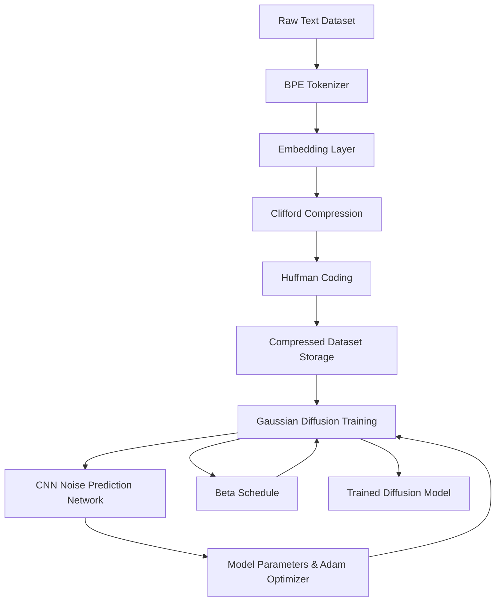

# Latent Diffusion NLP: Clifford-Optimized Generative Modeling (C++)

A high-performance latent diffusion pipeline for natural language processing, combining tokenization, geometric embedding compression, and CNN-based noise prediction. This project demonstrates an end-to-end approach to generative modeling optimized for hardware efficiency.

---

## Execution Logic: `Main.cpp`

The core framework is orchestrated within `Main.cpp`, which manages the lifecycle of latent representations through four distinct phases:

### 1. Tokenization & Embedding
The pipeline processes raw text into a compact vocabulary using a custom **BPE (Byte-Pair Encoding) Tokenizer**. 
- **Dense Embedding:** Tokens are mapped into a 64-dimensional latent space.
- **Clifford Compression:** Embeddings are projected into a Clifford Manifold $C\ell_{p,q}(\mathbb{R})$ to retain multilinear relationships. This geometric approach allows for radical parameter reduction while maintaining the physical integrity of the token relationships.

### 2. Gaussian Diffusion Process
The forward diffusion process gradually injects Gaussian noise into the latent embeddings according to a variance schedule $\beta_t$:

$$x_t = \sqrt{1 - \beta_t} x_{t-1} + \sqrt{\beta_t} \epsilon, \quad \epsilon \sim \mathcal{N}(0, I)$$

### 3. CNN $\epsilon$-Prediction Network
A **Convolutional Neural Network (CNN)** is utilized as the core epsilon-predictor. Unlike standard MLPs, the CNN captures local spatial dependencies within the latent sequence:
- **Objective:** Minimize the Negative Log-Likelihood (NLL) of the noise distribution.
- **Optimization:** Gradients are computed via the `NormalDist` module to update the CNN kernels.

$$\mathcal{L} = -\log p_\theta(y \mid \mu, \sigma) = \frac{1}{2} \left( \frac{y - \mu}{\sigma} \right)^2 + \log(\sigma) + \frac{1}{2} \log(2\pi)$$

### 4. Adaptive BetaSchedule & Training Loop
The training loop utilizes a dynamic **BetaSchedule** that anneals the noise variance based on epoch progress and loss statistics. This ensures the model balances coarse-grained noise injection with fine-grained reconstruction:

$$\beta_{epoch} = \beta_0 \left(1 - \frac{epoch}{T}\right) + \frac{epoch}{T}$$

The reverse diffusion estimate $\mu_{t-1}$ is then used to reconstruct clean latent states from noisy inputs:

$$\mu_{t-1} = \frac{x_t - \beta_t \epsilon_\theta(x_t, t)}{\sqrt{1 - \beta_t}}$$

---

## Architecture Flow


graph LR
    X_{t-1}[x_{t-1}]
    Beta_t[Noise Variance \u03B2_t]
    Noise[\u03B5 \sim \mathcal{N}(0,I)]
    X_t[x_t]
    X_{t-1} --> |Add noise| X_t
    Beta_t --> X_t
    Noise --> X_t
    X_t --> |Predict \u03B5_\u03B8(x_t,t)| PredictedEps
    PredictedEps --> |Reverse mean \u03BC_{t-1}| X_{t-1}'
````
```
graph LR
    Epoch[Epoch]
    BetaStart[\u03B2_0]
    BetaEnd[1.0]
    Beta_t[\u03B2_{epoch}]
    Losses[NLL, Entropy Loss]
```
```
    Epoch --> Beta_t
    BetaStart --> Beta_t
    BetaEnd --> Beta_t
    Losses --> Beta_t
    Beta_t --> Epoch
`````
## Usage

Build and run the project using CMake. Supply a text dataset file and specify an output file for compressed Huffman encoded embeddings. Training runs for a configurable number of epochs with beta scheduling dynamically adjusting noise levels.

⸻

